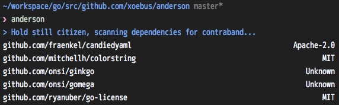
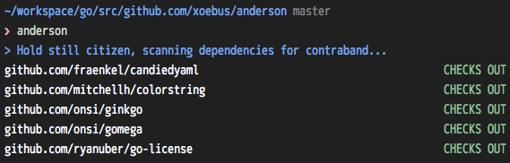

# anderson [](https://travis-ci.org/xoebus/anderson)

*checks your go dependencies for contraband licenses*


## usage

If you don't have an `.anderson.yml` in your current directory then a listing
of your dependencies and their license types are shown.



If you add a `.anderson.yml` file then your dependencies will be checked for
valid licenses. The syntax of this file can be found below.



Most of the package and dependency listing code was graciously taken from
[Godep](https://github.com/tools/godep).

## installation

```
go get -u github.com/xoebus/anderson
```

## configuration

You can configure *anderson* to be more or less lenient when checking you
dependencies. A file called `.anderson.yml` in the root of your Go package will
be checked when you run it.

``` yml
---
whitelist:
- MIT

blacklist:
- GPL

exceptions:
- github.com/xoebus/greylist
```

The whitelisted section is for licenses that are always allowed. Conversely,
the blacklist section is for licenses that are never allowed and will always
fail a build. Any licenses that are not explicitly mentioned are considered
to be in a "greylist" and will need to be explicitly allowed by adding the
import path to the exceptions.

